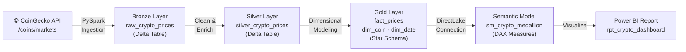
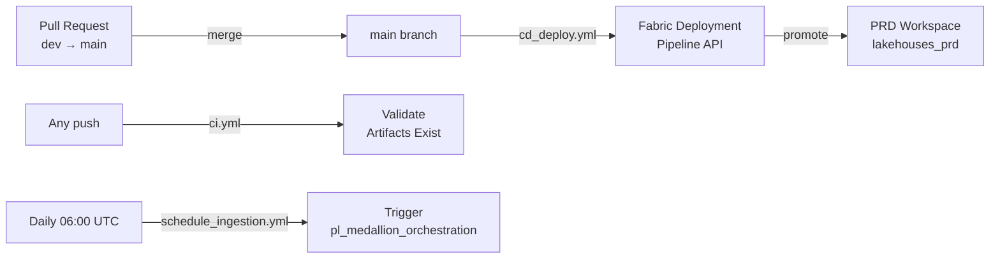

# Microsoft Fabric Medallion Lakehouse

[](https://github.com/amxavier/microsoft-fabric-medallion-lakehouse/actions/workflows/ci.yml)
[](https://github.com/amxavier/microsoft-fabric-medallion-lakehouse/actions/workflows/cd_deploy.yml)
[](https://github.com/amxavier/microsoft-fabric-medallion-lakehouse/actions/workflows/schedule_ingestion.yml)

End-to-end Data Engineering project on **Microsoft Fabric** implementing the **Medallion Architecture** (Bronze / Silver / Gold) with automated CI/CD via GitHub Actions.

Data source: [CoinGecko Public API](https://www.coingecko.com/en/api) — top 100 cryptocurrencies by market cap, ingested daily.

---

## Architecture



### Layer Responsibilities

| Layer | Table | Description |
|-------|-------|-------------|
| **Bronze** | `raw_crypto_prices` | Raw API response, append-only, idempotent by `ingestion_date` |
| **Silver** | `silver_crypto_prices` | Cleaned data + derived metrics: `price_vs_ath_pct`, `volume_to_market_cap_ratio`, `market_dominance_pct`, `market_cap_category` |
| **Gold** | `fact_prices` | Incremental fact table keyed to `dim_coin` and `dim_date` |
| **Gold** | `dim_coin` | SCD Type 1 coin dimension (name, symbol, category) |
| **Gold** | `dim_date` | Date dimension with time-intelligence attributes |

---

## Tech Stack

| Component | Technology |
|-----------|------------|
| Platform | Microsoft Fabric |
| Storage | OneLake (Delta Lake) |
| Processing | PySpark (Spark 3.x) |
| Orchestration | Fabric Data Pipeline |
| Semantic Layer | Power BI Semantic Model |
| Reporting | Power BI Report |
| CI/CD | GitHub Actions |
| Auth | Azure AD Service Principal |
| Deployment | Fabric Deployment Pipeline (DEV → PRD) |

---

## Environments

```
lakehouses_dev  (branch: dev)      lakehouses_prd  (branch: main)
├── lh_bronze                      ├── lh_bronze
├── lh_silver                      ├── lh_silver
└── lh_gold                        └── lh_gold
```

Promotion from DEV to PRD is managed by the **Fabric Deployment Pipeline** (`pipeline-medallion`), triggered automatically when a pull request is merged into `main`.

---

## CI/CD Pipeline



### Workflows

| File | Trigger | Purpose |
|------|---------|---------|
| `ci.yml` | Every push | Validates all 6 Fabric artifacts exist in the repository |
| `cd_deploy.yml` | Push to `main` | Calls Fabric Deployment Pipeline API to promote DEV → PRD |
| `schedule_ingestion.yml` | Daily at 06:00 UTC | Triggers `pl_medallion_orchestration` via Fabric REST API |

---

## Semantic Model — DAX Measures

| Measure | Description |
|---------|-------------|
| `Total Market Cap` | Sum of all coin market caps (USD) |
| `Total Volume 24h` | Sum of 24-hour trading volume |
| `Avg Price vs ATH` | Average percentage from all-time high |
| `Top Coin` | Coin with highest market cap |
| `Avg Price Change 7d` | Average 7-day price change (%) |
| `Large Cap Dominance` | Market cap share of Large Cap category |

---

## Project Structure

```
microsoft-fabric-medallion-lakehouse/
│
├── .github/
│   └── workflows/
│       ├── ci.yml                          # Artifact validation
│       ├── cd_deploy.yml                   # DEV → PRD deployment
│       └── schedule_ingestion.yml          # Daily ingestion trigger
│
├── nb_bronze_coingecko_ingestion.Notebook/ # Bronze: API → Delta Table
├── nb_silver_crypto_transform.Notebook/   # Silver: Clean + Enrich
├── nb_gold_crypto_model.Notebook/         # Gold: Star Schema
│
├── pl_medallion_orchestration.DataPipeline/ # Orchestrates Bronze→Silver→Gold
│
├── sm_crypto_medallion.SemanticModel/     # Power BI Semantic Model
├── rpt_crypto_dashboard.Report/          # Power BI Dashboard
│
└── README.md
```

---

## Getting Started

### Prerequisites

- Microsoft Fabric capacity (F2 or higher)
- Azure AD Service Principal with Contributor access to both workspaces
- GitHub repository with Actions enabled

### Required GitHub Secrets

| Secret | Description |
|--------|-------------|
| `AZURE_CLIENT_ID` | Service Principal Application (Client) ID |
| `AZURE_TENANT_ID` | Azure AD Tenant ID |
| `AZURE_CLIENT_SECRET` | Service Principal Client Secret |
| `FABRIC_WORKSPACE_ID_DEV` | DEV workspace GUID |
| `FABRIC_DEPLOYMENT_PIPELINE_ID` | Fabric Deployment Pipeline GUID |
| `FABRIC_PIPELINE_ID` | `pl_medallion_orchestration` item GUID |

### Setup

1. Fork this repository
2. Create two Fabric workspaces: `lakehouses_dev` and `lakehouses_prd`
3. Create one Lakehouse per layer in each workspace (`lh_bronze_*`, `lh_silver_*`, `lh_gold_*`)
4. Configure Fabric Git Integration: `dev` branch → DEV workspace, `main` branch → PRD workspace
5. Create a Fabric Deployment Pipeline linking both workspaces
6. Register an Azure AD Service Principal and add it as a Contributor to both workspaces
7. Add all required secrets to GitHub repository settings
8. Push to `dev` branch — CI runs automatically; merge to `main` to trigger deployment

---

## Key Design Decisions

**Cross-lakehouse reads via ABFS paths** — Fabric does not support cross-lakehouse table references with `spark.read.table()`. Notebooks use `notebookutils.lakehouse.get()` to resolve ABFS paths dynamically, avoiding hardcoded paths and enabling portability across DEV and PRD.

**Idempotent ingestion** — Each layer checks for existing `ingestion_date` records before writing, preventing duplicate data on pipeline reruns.

**Star Schema in Gold** — `dim_coin` uses SCD Type 1 (overwrite on each run); `dim_date` is built once; `fact_prices` appends incrementally. This enables time-series analysis and Power BI time intelligence.

---

## Author

**Andrelino Xavier** — Data Engineer  
[GitHub](https://github.com/amxavier) · [LinkedIn](https://linkedin.com/in/andrexavier)

---

*Built as a Data Engineering project to demonstrate end-to-end skills on the Microsoft Fabric platform.*
