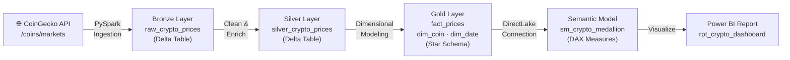
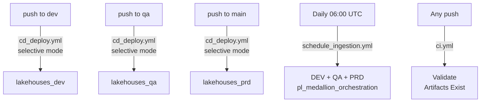

# Microsoft Fabric Medallion Lakehouse

[](https://github.com/amxavier/microsoft-fabric-medallion-lakehouse/actions/workflows/ci.yml)
[](https://github.com/amxavier/microsoft-fabric-medallion-lakehouse/actions/workflows/cd_deploy.yml)
[](https://github.com/amxavier/microsoft-fabric-medallion-lakehouse/actions/workflows/schedule_ingestion.yml)

End-to-end Data Engineering project on **Microsoft Fabric** implementing the **Medallion Architecture** (Bronze / Silver / Gold) with enterprise-grade CI/CD via GitHub Actions and the Fabric REST API.

Data source: [CoinGecko Public API](https://www.coingecko.com/en/api) — top 100 cryptocurrencies by market cap, ingested daily.

---

## Architecture


```mermaid
flowchart LR
    API["🌐 CoinGecko API\n/coins/markets"]
    B["Bronze Layer\nraw_crypto_prices\n(Delta Table)"]
    S["Silver Layer\nsilver_crypto_prices\n(Delta Table)"]
    G["Gold Layer\nfact_prices\ndim_coin · dim_date\n(Star Schema)"]
    SM["Semantic Model\nsm_crypto_medallion\n(DAX Measures)"]
    PBI["Power BI Report\nrpt_crypto_dashboard"]

    API -->|"PySpark\nIngestion"| B
    B -->|"Clean &\nEnrich"| S
    S -->|"Dimensional\nModeling"| G
    G -->|"DirectLake\nConnection"| SM
    SM -->|"Visualize"| PBI
```

### Layer Responsibilities

| Layer | Table | Description |
|-------|-------|-------------|
| **Bronze** | `raw_crypto_prices` | Raw API response, append-only, idempotent by `ingestion_date` |
| **Silver** | `silver_crypto_prices` | Cleaned data + derived metrics: `price_vs_ath_pct`, `volume_to_market_cap_ratio`, `market_dominance_pct`, `market_cap_category` |
| **Gold** | `fact_prices` | Incremental fact table keyed to `dim_coin` and `dim_date` |
| **Gold** | `dim_coin` | SCD Type 1 coin dimension (name, symbol, category) |
| **Gold** | `dim_date` | Date dimension with time-intelligence attributes |

---

## Tech Stack

| Component | Technology |
|-----------|------------|
| Platform | Microsoft Fabric |
| Storage | OneLake (Delta Lake) |
| Processing | PySpark (Spark 3.x) |
| Orchestration | Fabric Data Pipeline |
| Semantic Layer | Power BI Semantic Model (DirectLake) |
| Reporting | Power BI Report (PBIR format) |
| CI/CD | GitHub Actions |
| Auth | Azure AD Service Principal |
| Deployment | Fabric REST API (direct, 3-phase) |

---

## Environments

Three isolated workspaces map 1:1 to Git branches:

```
dev branch  →  lakehouses_dev   (development)
qa branch   →  lakehouses_qa    (validation)
main branch →  lakehouses_prd   (production)
```

Each workspace contains its own `lh_bronze`, `lh_silver`, and `lh_gold` Lakehouses. Environment-specific GUIDs (OneLake URLs, workspace IDs) are managed in `config/valueSets/`.

---

## CI/CD Pipeline


```mermaid
flowchart TD
    Dev["push to dev"] -->|"cd_deploy.yml\nselective mode"| DEV["lakehouses_dev"]
    QA["push to qa"] -->|"cd_deploy.yml\nselective mode"| QAW["lakehouses_qa"]
    Main["push to main"] -->|"cd_deploy.yml\nselective mode"| PRD["lakehouses_prd"]

    Cron["Daily 06:00 UTC"] -->|"schedule_ingestion.yml"| All["DEV + QA + PRD\npl_medallion_orchestration"]

    Push["Any push"] -->|"ci.yml"| CI["Validate\nArtifacts Exist"]
```

### Deploy Strategy

Artifacts are deployed directly to Fabric workspaces via the **Fabric REST API** — no Git Integration, no native Deployment Pipeline. This approach gives full programmatic control over every deployment step.

**Selective mode** (default): only artifacts changed since the last commit are deployed, minimising API calls and deploy time.  
**Full mode**: all artifacts are deployed, used for first-time environment setup via `workflow_dispatch`.

### 3-Phase Deploy Order

Dependencies between Fabric items require a strict deployment sequence:

| Phase | Items | Why |
|-------|-------|-----|
| **1** | Notebooks + Semantic Model | No cross-item dependencies |
| **2** | Data Pipeline | References notebooks by workspace item ID — patched after Phase 1 |
| **3** | Report | References Semantic Model via XMLA connection string — patched after Phase 1 |

**Pipeline patching**: `pipeline-content.json` stores notebook references as `.platform` `logicalId` values (Git-safe). The deploy script resolves these to actual workspace item IDs after Phase 1 completes.

**Report patching**: `definition.pbir` uses `byPath` in the repository (for readability). The deploy script converts it to `byConnection` with a Power BI XMLA endpoint connection string including the `semanticModelId` of the deployed model.

**DirectLake patching**: `expressions.tmdl` contains the DEV OneLake URL. The deploy script replaces it with the target environment URL before uploading.

### Workflows

| File | Trigger | Purpose |
|------|---------|---------|
| `ci.yml` | Every push | Validates all Fabric artifacts exist in the repository |
| `cd_deploy.yml` | Push to `dev`, `qa`, `main` | Deploys changed artifacts to the matching workspace via REST API |
| `schedule_ingestion.yml` | Daily at 06:00 UTC | Triggers `pl_medallion_orchestration` in DEV, QA, and PRD |

---

## Semantic Model — DAX Measures

| Measure | Description |
|---------|-------------|
| `Total Market Cap` | Sum of all coin market caps (USD) |
| `Total Volume 24h` | Sum of 24-hour trading volume |
| `Avg Price vs ATH` | Average percentage from all-time high |
| `Top Coin` | Coin with highest market cap |
| `Avg Price Change 7d` | Average 7-day price change (%) |
| `Large Cap Dominance` | Market cap share of Large Cap category |

---

## Project Structure

```
microsoft-fabric-medallion-lakehouse/
│
├── .github/
│   └── workflows/
│       ├── ci.yml                    # Artifact validation
│       ├── cd_deploy.yml             # Enterprise deploy via Fabric REST API
│       ├── cd_deploy_legacy.yml      # Archived: Deployment Pipeline approach
│       └── schedule_ingestion.yml    # Daily ingestion trigger (DEV + QA + PRD)
│
├── config/
│   └── valueSets/
│       ├── dev.json                  # DEV workspace ID + OneLake URL
│       ├── qa.json                   # QA workspace ID + OneLake URL
│       └── main.json                 # PRD workspace ID + OneLake URL
│
├── scripts/
│   ├── deploy.py                     # 3-phase deploy orchestration
│   ├── fabric_client.py              # Fabric REST API wrapper
│   └── utils.py                      # Artifact helpers: patch, encode, diff
│
├── notebooks/
│   ├── nb_bronze_coingecko_ingestion.Notebook/
│   ├── nb_bronze_governance_fabric.Notebook/
│   ├── nb_silver_crypto_transform.Notebook/
│   └── nb_gold_crypto_model.Notebook/
│
├── pipelines/
│   └── pl_medallion_orchestration.DataPipeline/
│
├── semantic models/
│   └── sm_crypto_medallion.SemanticModel/
│
├── report/
│   └── rpt_crypto_dashboard .Report/
│
├── requirements.txt
└── README.md
```

---

## Getting Started

### Prerequisites

- Microsoft Fabric capacity (F2 or higher)
- Azure AD Service Principal with Member access to all three workspaces
- GitHub repository with Actions enabled

### Required GitHub Secrets

| Secret | Description |
|--------|-------------|
| `AZURE_TENANT_ID` | Azure AD Tenant ID |
| `AZURE_CLIENT_ID` | Service Principal Application (Client) ID |
| `AZURE_CLIENT_SECRET` | Service Principal Client Secret (Value, not ID) |
| `FABRIC_WORKSPACE_ID_DEV` | DEV workspace GUID |
| `FABRIC_WORKSPACE_ID_QA` | QA workspace GUID |
| `FABRIC_WORKSPACE_ID_PRD` | PRD workspace GUID |
| `FABRIC_PIPELINE_ID` | `pl_medallion_orchestration` item GUID in DEV |
| `FABRIC_PIPELINE_ID_QA` | `pl_medallion_orchestration` item GUID in QA |
| `FABRIC_PIPELINE_ID_PRD` | `pl_medallion_orchestration` item GUID in PRD |

### Setup

1. Fork this repository
2. Create three Fabric workspaces: `lakehouses_dev`, `lakehouses_qa`, `lakehouses_prd`
3. Create `lh_bronze`, `lh_silver`, `lh_gold` in each workspace
4. Register an Azure AD Service Principal and add it as a **Member** to all three workspaces
5. Update `config/valueSets/dev.json`, `qa.json`, and `main.json` with your workspace and OneLake GUIDs
6. Add all required secrets to GitHub repository settings
7. Run the `CD - Deploy to Fabric` workflow in **full** mode for each environment to bootstrap
8. Push to `dev` to trigger selective deploys automatically

---

## Key Design Decisions

**Direct REST API deploy over native Deployment Pipeline** — Gives full programmatic control: selective deploys, environment-specific patching, and no dependency on Fabric's Git Integration. The same approach scales to any number of environments without portal configuration.

**3-phase phased deploy** — Fabric items have runtime cross-references that are invisible at the file level. Deploying in dependency order (Notebooks → Pipeline → Report) and resolving IDs between phases avoids circular reference errors.

**Cross-lakehouse reads via ABFS paths** — Fabric does not support cross-lakehouse table references with `spark.read.table()`. Notebooks use `notebookutils.lakehouse.get()` to resolve ABFS paths dynamically, enabling portability across environments.

**Idempotent ingestion** — Each layer checks for existing `ingestion_date` records before writing, preventing duplicate data on pipeline reruns.

**Star Schema in Gold** — `dim_coin` uses SCD Type 1 (overwrite on each run); `dim_date` is built once; `fact_prices` appends incrementally. This enables time-series analysis and Power BI time intelligence.

---

## Author

**Andrelino Xavier** — Data Engineer  
[GitHub](https://github.com/amxavier) · [LinkedIn](https://linkedin.com/in/andrexavier)

---

*Built as a Data Engineering portfolio project to demonstrate end-to-end skills on the Microsoft Fabric platform.*
